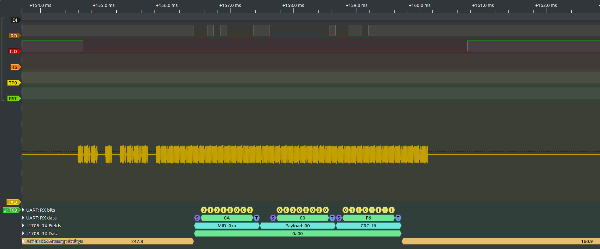

# sr-j1708

This decoder stacks on top of the 'uart' PD and decodes the J1708 protocol.

* It decodes only the UART RX line (J1708 uses a shared medium).
* Requires UART PD at 9600bps 8n1 lsb-first settings
* There is a configurable message break of 2, 10 or 12 (UART) bit-times.
* Applicable also to decoding J1587 and/or J2497 UART bytes but doesn't perform any PID grouping or pretty-printing. For that functionality see e.g. https://github.com/ainfosec/pretty_j1587 and https://github.com/TruckHacking/py-hv-networks.

Here is an example of decoding the output of a Intellon SSC P485 J2497 'converter.' The logic analyzer is connected to the digital outputs of the P485 and decoding the UART-decoded RO line. It is not decoding the J2497 waveform which is just shown here for reference (but that would be a great feature!)




## Installing

To install on Linux, clone this repo and create a symbolic link to the cloned directory in your `~/.local/share/libsigrokdecode/decoders/`

```sh
git clone https://github.com/TruckHacking/sr-j1708
ln -nsf $(pwd)/sr-j1708 ~/.local/share/libsigrokdecode/decoders/
```

To install on Windows, download the code as zip (or clone) and extract (or copy) into a new folder in the PulseView decoders folder -- which is probably `C:\Program Files\sigrok\PulseView\share\libsigrokdecode\decoders`.